---
## Front matter
lang: ru-RU
title: "Групповой проект. Этап 3"
subtitle: "Рост дендритов"
author:
  Дорук Мерич, 
	Мухамедиар Адиль,
	Яссин Мохамад Аламин,
	Акуленко Максим
institute:
  - Российский университет дружбы народов, Москва, Россия
date: 11.03.2023

## i18n babel
babel-lang: russian
babel-otherlangs: english

## Formatting pdf
toc: false
toc-title: Содержание
slide_level: 2
aspectratio: 169
section-titles: true
theme: metropolis
header-includes:
 - \metroset{progressbar=frametitle,sectionpage=progressbar,numbering=fraction}
 - '\makeatletter'
 - '\beamer@ignorenonframefalse'
 - '\makeatother'
---

## Цели и задачи группового проекта

**Цель проекта:** На основе построения модели роста
дендритов, изучить принципы математического
моделирования. 

**Задачи проекта:**   
1. изучить теоретическую информацию о дендритах и о
моделях их роста;

2. разработать алгоритмы

3. написать программу, взяв в основу разработанные ранее алгоритмы;

4. проанализировать полученные результаты.

 
## Основные понятия и уравнения
- $M$ - Количество итераций(шагов)
- $x$ - удельная теплота плавления на единицу массы  
- $y$ - теплоемкость при постоянном давление (также на единицу массы)  
- $k$ - коэфицент теплопроводности  
- $T_m$ - температура плавления  
- $T_\infty < T_m$  
- $\omega$ - Kоэффициент, учитывающий влияние диагональных соседей
- $h$ - Расстояние между узлами по вертикали и горизонтали
- $\delta$ - Шаг по времени
- $c_p$ - Теплоемкость при постоянном давлении на единицу массы
- $L$ - Удельная теплота плавления на единицу массы
- $Grad$ - Массив для хранения температурного градиента  
- $Cal-grad-tem$ - Вычисляет температурный градиент в каждой ячейке(интерация по всем, кроме границ + для каждого SumT соседнего => T в каждой ячейке
- $Upd-temp$ - Обновляет T в каждой
- $Status$ - Обновляет статус каждой + Sum стату соседей (если статус > нужного, то ячейка превращается в дендрит)  

## Код проекта Алгоритм роста дендритов

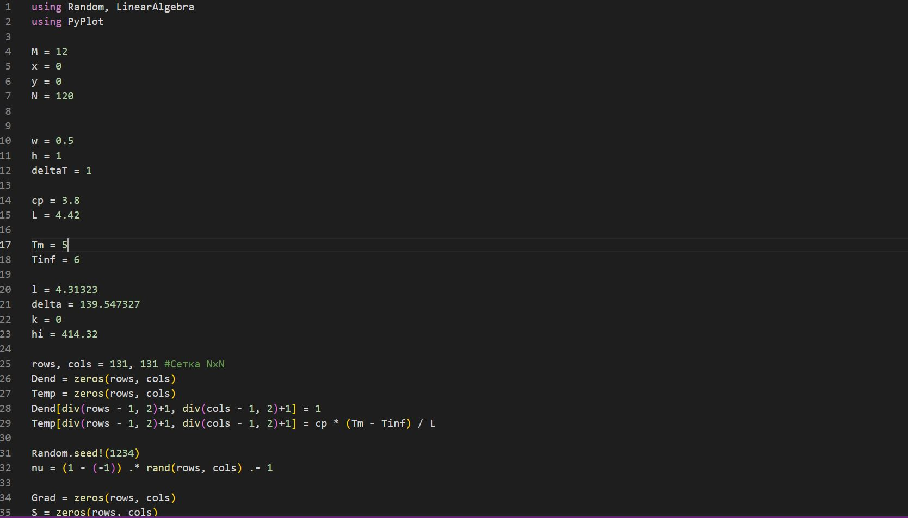{ #fig:001 width=70% height=70% }

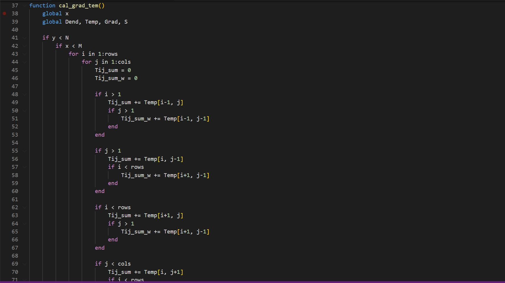{ #fig:002 width=70% height=70% }

{ #fig:003 width=70% height=70% }

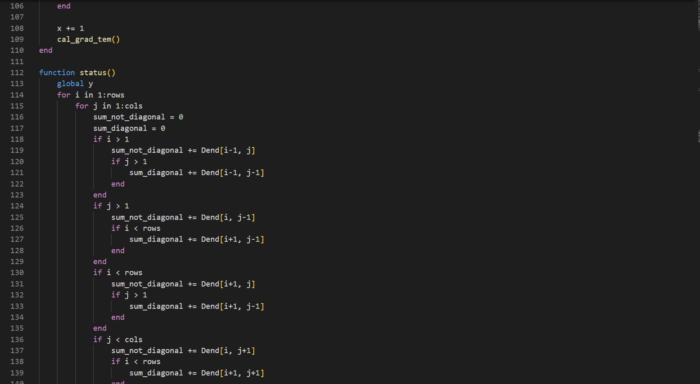{ #fig:004 width=70% height=70% }

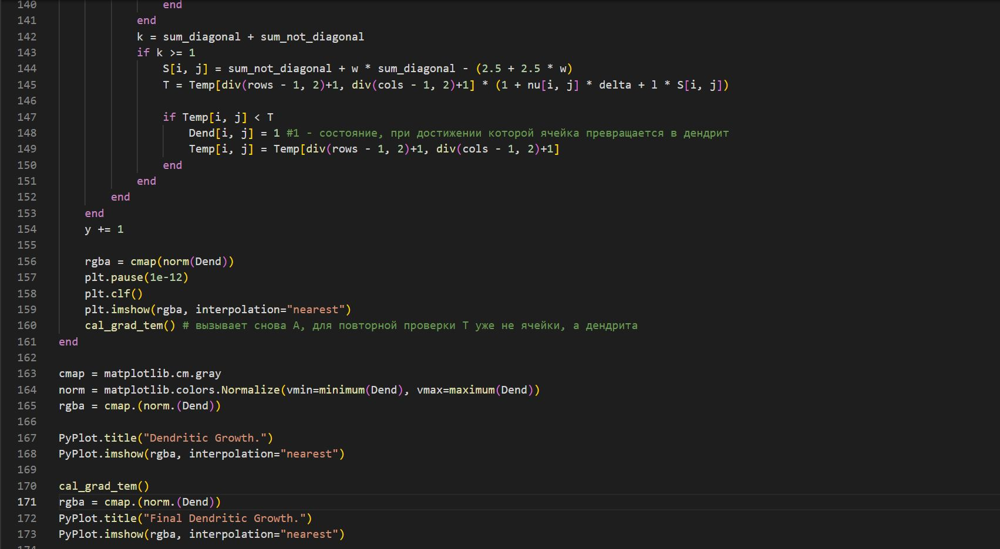{ #fig:005 width=70% height=70% }

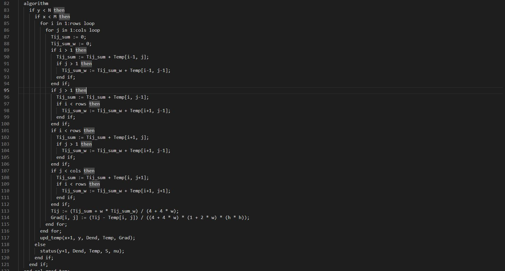{ #fig:006 width=70% height=70% }

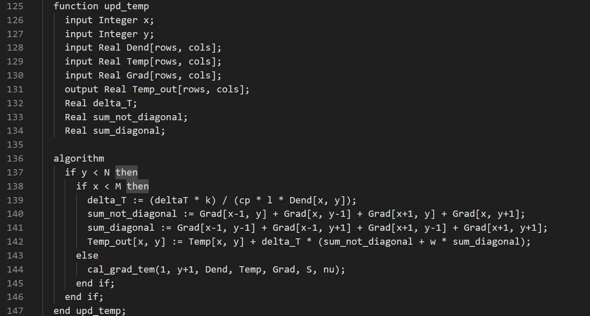{ #fig:007 width=70% height=70% }

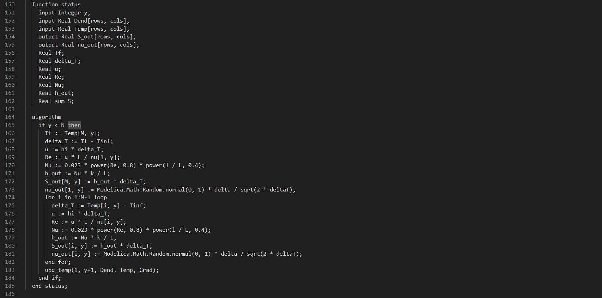{ #fig:008 width=70% height=70% }

## Результаты
{ #fig:009 width=70% height=70% }
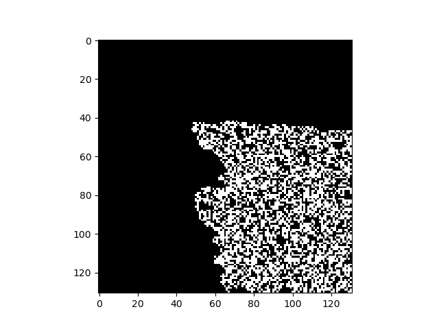{ #fig:010 width=70% height=70% }
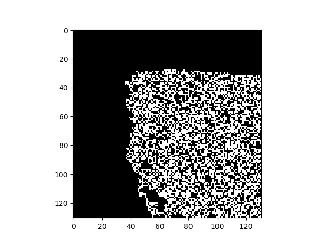{ #fig:011 width=70% height=70% }
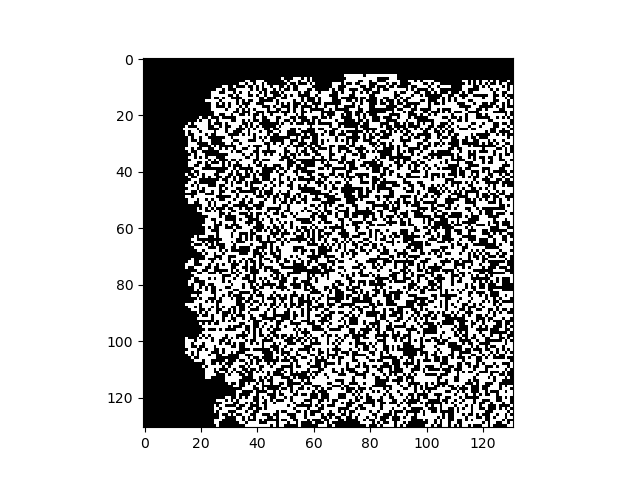{ #fig:012 width=70% height=70% }
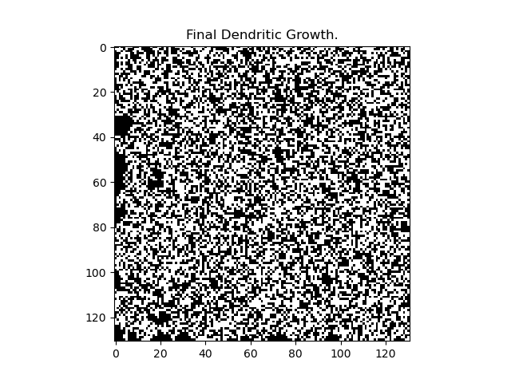{ #fig:013 width=70% height=70% }

## Вывод
На данном этапе рассмотрели алгоритм по созданию и
росту дендритов
Изучили каждый из его этапов и построили схему.

    

  
  ### 
Спасибо за внимание!
 

