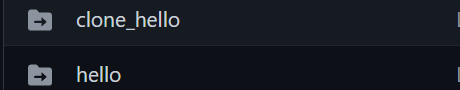

---
## Front matter
lang: ru-RU
title: Работа с Git
subtitle: Простейший шаблон
author:
  - Яссин Мохамад Аламин.
institute:
  - Российский университет дружбы народов, Москва, Россия
date: 11/02/2023

## i18n babel
babel-lang: russian
babel-otherlangs: english

## Formatting pdf
toc: false
toc-title: Содержание
slide_level: 2
aspectratio: 169
section-titles: true
theme: metropolis
header-includes:
 - \metroset{progressbar=frametitle,sectionpage=progressbar,numbering=fraction}
 - '\makeatletter'
 - '\beamer@ignorenonframefalse'
 - '\makeatother'
---

## Лабораторная работа № 1

  * Яссин Мохамад Аламин
  * НКНБД-01-20, студ.билет:1032205004
  * Российский университет дружбы народов

## Цель работы

- Научиться работе с Git и языком разметки Markdown

- Создание отчёта по лабораторной работе Git в формате Markdown

- Получение знаний

## Git

- Git — система управления версиями с распределенной архитектурой.

- Git — абсолютный лидер по популярности среди современных систем управления версиями. Это развитый проект с активной поддержкой и открытым исходным кодом. Система Git была изначально разработана в Линусом Торвальдсом.

- Git применяется для управления версиями в рамках колоссального количества проектов по разработке

## Markdown

- Markdown — язык разметки текстов. Такие тексты легко писать и читать. Их можно без труда сконвертировать в HTML.

- Markdown — создан писателем и блогером Джоном Грубером  с целью обозначения форматирования в простом тексте.

## Результаты

- Контроль версий с помощью Git:
  - Использовать коммиты.
  - Создавать репозитории.
  - Создание, изменения и навигация веток.
  - Отправлять изменения на сервер GitHub.

- Работа с Git Bash:
  - Создание каталога.
  - Создание новых файлов и папок.
  - Редактирование файлов.

- Работа с Markdown:
  - Сделать отчет по лабораторной с Markdown.
  
  - Выделять текст *курсивом* и **жирным** или ***одновременно***.
  
  - Создавать заголовки.
  
  - А также создавать списки как этот.
  

    