---
## Front matter
title: "Шаблон отчёта по лабораторной работе"
subtitle: "Простейший вариант"
author: "Яссин Мохамад Аламин"

## Generic otions
lang: ru-RU
toc-title: "Содержание"

## Bibliography
bibliography: bib/cite.bib
csl: pandoc/csl/gost-r-7-0-5-2008-numeric.csl

## Pdf output format
toc: true # Table of contents
toc-depth: 2
lof: true # List of figures
lot: true # List of tables
fontsize: 12pt
linestretch: 1.5
papersize: a4
documentclass: scrreprt
## I18n polyglossia
polyglossia-lang:
  name: russian
  options:
	- spelling=modern
	- babelshorthands=true
polyglossia-otherlangs:
  name: english
## I18n babel
babel-lang: russian
babel-otherlangs: english
## Fonts
mainfont: PT Serif
romanfont: PT Serif
sansfont: PT Sans
monofont: PT Mono
mainfontoptions: Ligatures=TeX
romanfontoptions: Ligatures=TeX
sansfontoptions: Ligatures=TeX,Scale=MatchLowercase
monofontoptions: Scale=MatchLowercase,Scale=0.9
## Biblatex
biblatex: true
biblio-style: "gost-numeric"
biblatexoptions:
  - parentracker=true
  - backend=biber
  - hyperref=auto
  - language=auto
  - autolang=other*
  - citestyle=gost-numeric
## Pandoc-crossref LaTeX customization
figureTitle: "Рис."
tableTitle: "Таблица"
listingTitle: "Листинг"
lofTitle: "Список иллюстраций"
lotTitle: "Список таблиц"
lolTitle: "Листинги"
## Misc options
indent: true
header-includes:
  - \usepackage{indentfirst}
  - \usepackage{float} # keep figures where there are in the text
  - \floatplacement{figure}{H} # keep figures where there are in the text
---

# Цель работы

Oзнакомиться с git и настроить как локальный, так и удаленный репозиторий для курса

# Задание

Создание отчёта по предыдущей лабораторной работе Git в формате Markdown

# Теоретическое введение

Git — это система контроля версий, которая позволяет отслеживать и фиксировать изменения в коде: вы можете восстановить код в случае сбоя или откатить до более ранних версий. С Git работают через командную строку или инструменты вроде GitHub. Команды Git принимают вид git <команда> <аргументы>, где аргументом может быть путь к файлу. В команды также включаются опции, которые обозначаются как --<опция>.

Markdown — это синтаксис (или набор правил), который форматирует текст на веб-страницах. Markdown упрощает форматирование текста для веб-страниц, поскольку теги проще, чем HTML, и они автоматически преобразуются в HTML. Это означает, что вам не нужно знать HTML, чтобы написать что-то для веб-страницы, потому что Markdown переводит ваши теги в HTML для вас. Он охватывает не все возможные теги HTML, а наиболее распространенные параметры форматирования.

# Выполнение лабораторной работы
## 1.1 Подготовка работы с git
Параметры установки окончаний строк**
Я с помощью команд git config --global core.autocrlf true и git config --global core.safecrlf true настроила core.autocrlf, чтобы все переводы строк текстовых файлов в репозитории были одинаковы (рис. 1.1).
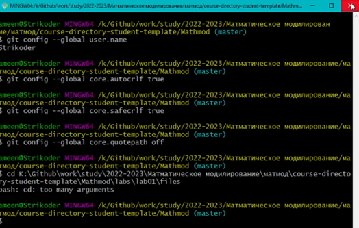{#fig:001 width=70%}

## 1.2 Создание проекта и добавление его в репозиторий(рис. 1.2)
**1.2 Создадим пустой каталог hello и создадим там файл с именем hello.html (рис. 02)**
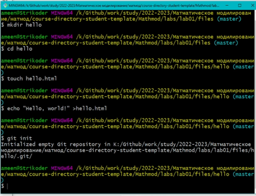{#fig:002 width=70%}

**1.3 Используем команду git status, чтобы проверить текущее состояние repo.(рис. 03)**
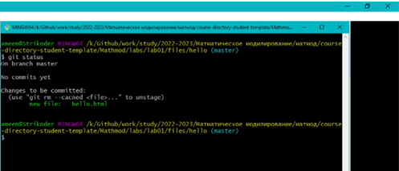{#fig:003 width=70%}

## 1.3 Внесение изменений
**1.3.1 Изменение страницы** `Hello, World`
{#fig:004 width=70%}

## 1.4 Индексация изменений

**1.4.1 Коммит изменений**

Сделаем коммит и проверим состояние с помощью git commit.(рис.10) Открылся редактор, в котором я написала комментарий: "Added h1 tag". (рис. 05)
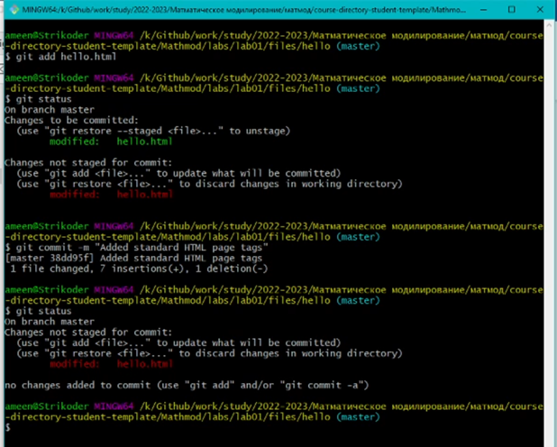{#fig:005 width=70%}

**Проверим состояние каталога с помощью git status.(рис.06)**
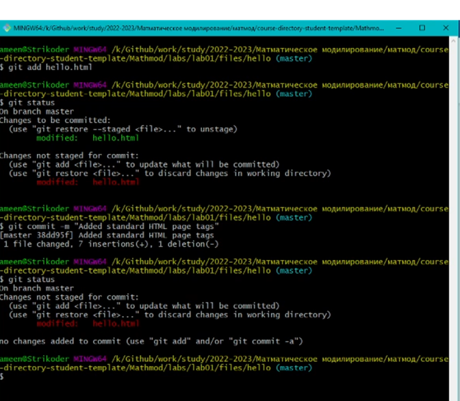{#fig:006 width=70%}

**1.4.2 История**
Получим список произведенных изменений с помощью git log.(рис.07)
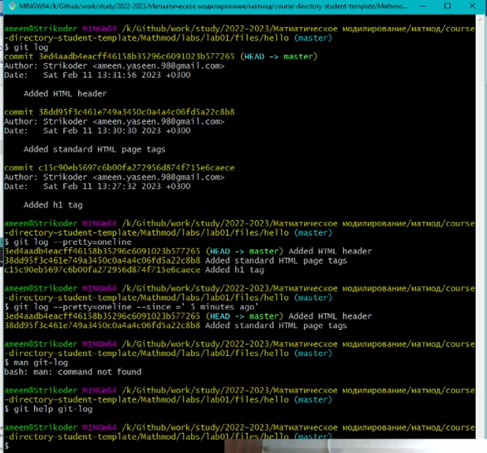{#fig:007 width=70%}

**1.4.4 Получение старых версий**
Изучим данные лога и найдем хэш для первого коммита. Затем проверим содержимое файла hello.html с помощью git checkout и cat hello.html.(рис.08)
{#fig:008 width=70%}

Вернемся к последней версии в ветке master (рис.09):
git checkout master 
cat hello.html
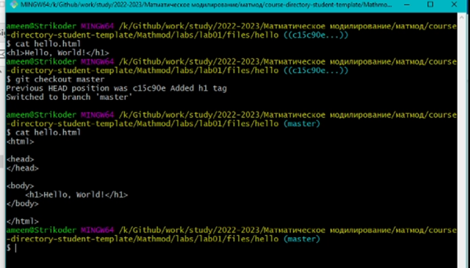{#fig:009 width=70%}

**1.4.5 Создание тегов версий**

Создадим тег первой версии  с помощью git tag v1.(рис.10)

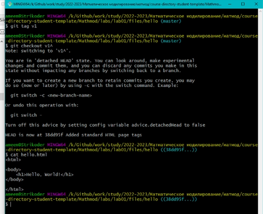{#fig:010 width=70%}

Теперь текущая версия страницы называется v1.

Создадим тег для версии, которая идет перед текущей версией и назовем его v1-beta:

git checkout v1^

cat hello.html

И сделаем ее версией v1-beta: git tag v1-beta.(рис.11)

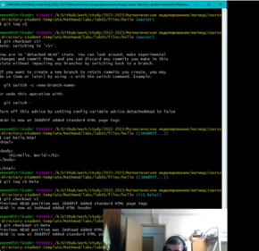{#fig:011 width=70%}

**1.4.6 Переключение по имени тега + 1.4.7 Просмотр тегов с помощью команды tag**

Попробуем попереключаться  между двумя отмеченными версиями (рис.12):

git checkout v1 

git checkout v1-beta

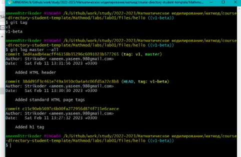{#fig:012 width=70%}

## 1.5 Отмена локальных изменений (до индексации)
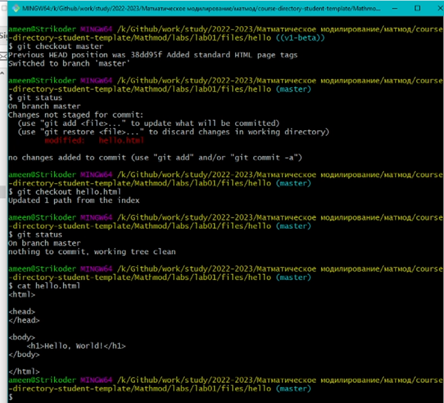{#fig:013 width=70%}

## 1.7 Отмена коммитов

**1.7.1 Отмена коммитов**

Мы отменим коммит путем создания нового коммита, отменяющего нежелательные измененя.

**1.7.2 Изменим файл и сделаем коммит**

Изменим файл hello.html на следующий. (рис.14)
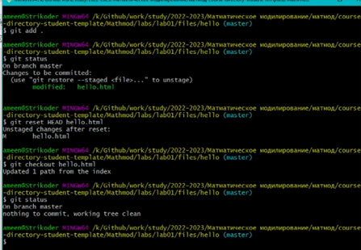{#fig:014 width=70%}

Выполним следующие команды (рис.15):

git add hello.html 

git commit -m "Oops, we didn't want this commit"
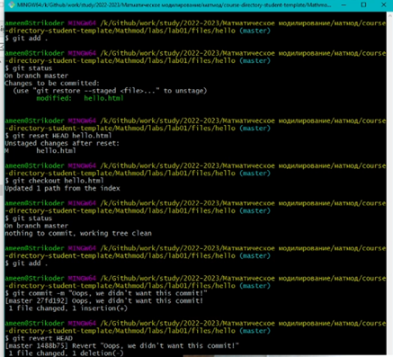{#fig:015 width=70%}

**1.7.3 Сделайте коммит с новыми изменениями, отменяющими предыдущие**

Чтобы отменить коммит, нам необходимо сделать коммит, который удаляет изменения, сохраненные нежелательным коммитом.

**1.7.4 Проверим лог**

Проверка лога с помощью команды git log показывает нежелательные и отмененные коммиты в наш репозиторий.(рис.16)
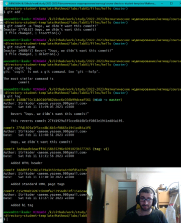{#fig:016 width=70%}

## 1.8 Удаление коммитов из ветки

**1.8.1 Команда git reset**

При получении ссылки на коммит (т.е. хэш, ветка или имя тега), команда git reset: 

перепишет текущую ветку, чтобы она указывал на нужный коммит; 

опционально сбросит буферную зону для соответствия с указанным коммитом; 

опционально сбросит рабочий каталог для соответствия с указанным коммитом.

**1.8.2 Проверим нашу историю**

Сделаем быструю проверку нашей истории коммитов с помощью git log.(рис.17)

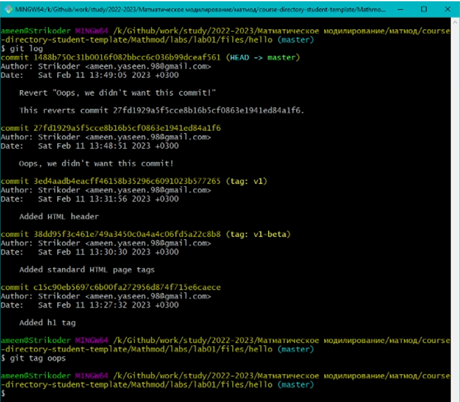{#fig:017 width=70%}

**1.8.3 Для начала отметим эту ветку**

Прежде чем удалять коммиты, отметим последний коммит тегом, чтобы потом можно было его найти:git tag oops.(рис.18)

{#fig:018 width=70%}

**1.8.4 Сброс коммитов к предшествующим коммиту Oops**

Глядя на историю лога, мы видим, что коммит с тегом «v1» является коммитом, предшествующим ошибочному коммиту. Сбросим ветку до этой точки (рис.44):

git reset --hard v1 

git log

**1.8.5 Ничего никогда не теряется**

Коммиты все еще находятся в репозитории.  Чтобы посмотреть на все коммиты , нужно применить команду git log --all.(рис.19)

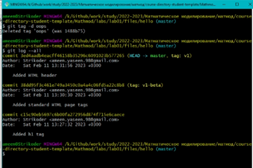{#fig:019 width=70%}

## 1.11 Перемещение файлов

**1.11.1 Переместите файл hello.html в каталог lib**

Перенсел страницу в каталог lib:

**1.12.1 Коммит в новый каталог**

Сделаем коммит перемещения: git commit -m "Moved hello.html to lib".(рис.20)

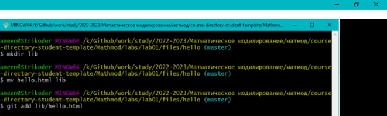{#fig:020 width=70%}

## 1.14 Git внутри: Каталог .git

**1.14.1 Каталог .git**

Это каталог, в котором хранится вся информация git.

**1.14.2 База данных объектов**

Выполнил ls -C .git/objects.(рис.21)

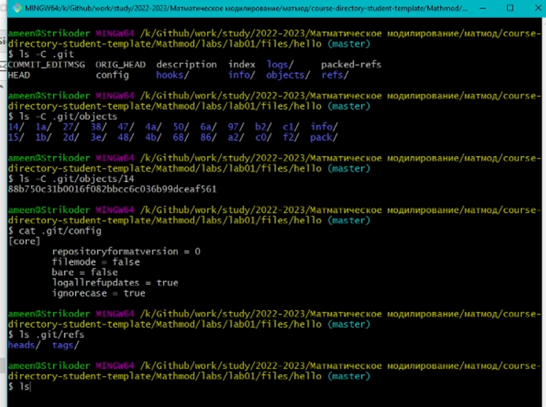{#fig:021 width=70%}
**1.14.3 Углубляемся в базу данных объектов**

Выполнил ls -C .git/objects/

**1.14.4 Config File**

Выполнил cat .git/config.

**1.14.5 Ветки и теги**

Выполнил (рис.22):

ls .git/refs 

ls .git/refs/heads

ls .git/refs/tags 

cat .git/refs/tags/v1

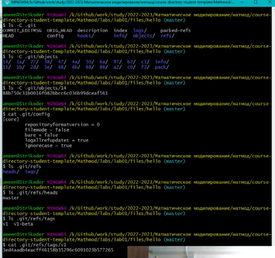{#fig:022 width=70%}

## 1.15 Работа непосредственно с объектами git

**1.15.1 Поиск последнего коммита**

Выполнил git log --max-count=1.

Эта команда должна показать последний коммит в репозиторий.

**1.15.2 Вывод последнего коммита с помощью SHA1 хэша**

Выполнил git cat-file -t и git cat-file -p.

**1.15.3 Поиск дерева**

Мы можем вывести дерево каталогов, ссылка на который идет в коммите.

Выполнил git cat-file -p <\treehash>.

**1.15.4 Вывод каталога lib**

Выполнил git cat-file -p <\libhash>.

**1.15.5 Вывод файла hello.html**

Выполнил git cat-file -p <\hellohash>.(рис.23)

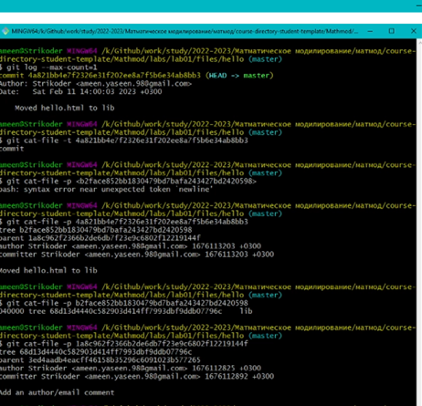{#fig:023 width=70%}

## 1.16 Создание ветки

**1.16.1 Создайте ветку**

Назовем нашу новую ветку «style».

Выполним :

git checkout -b style

git status

**1.16.2 Добавим файл стилей style.css**

**1.16.3 Изменим основную страницу**

**1.16.4 Изменим index.html**

Обновим файл index.html, чтобы он тоже использовал style.css.(рис.23-24)

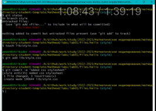{#fig:023 width=70%}

Выполнил (рис.74):

git add index.html 

git commit -m "Updated index.html"

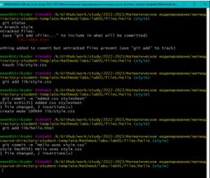{#fig:024 width=70%}

## 1.18 Изменения в ветке master

**1.18.1 Создайте файл README в ветке master**

Выполним git checkout master и создадим файл README.md: echo "This is the Hello World example from the git tutorial." > README.md.

## 1.19 Сделайте коммит изменений README.md в ветку master.

Выполнил 

git add README.md 

git commit -m "Added README"

**1.19.1 Просмотр отличающихся веток**

Теперь у нас в репозитории есть две отличающиеся ветки. Выполнил git log --graph --all.(рис.25)

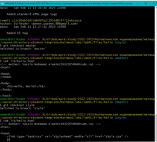{#fig:025 width=70%}

## 1.20 Слияние

**1.20.1 Слияние веток**

Слияние переносит изменения из двух веток в одну. Вернемся к ветке style и сольем master с style и выполним следующие команды (рис.26):

git checkout style 

git merge master 

git log --graph --all

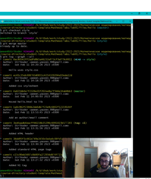{#fig:026 width=70%}

## 1.21 Создание конфликта

**1.21.1 Вернитесь в master и создайте конфликт**

Вернемся в ветку master и внесем следующие изменения: 

Выполнил git checkout master.(рис.82)

Файл lib/hello.html.

Выполнил

git add lib/hello.html 

git commit -m 'Life is great'

**1.21.2 Просмотр веток**

Выполним git log --graph --all.(рис.27)

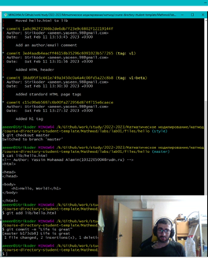{#fig:027 width=70%}

**1.22.2 Решение конфликта**

Внесем изменения в lib/hello.html для достижения следующего результата.(рис.28)

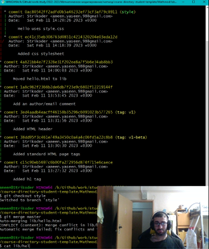{#fig:028 width=70%}

## 1.23 Клонирование репозиториев

**1.23.1 Перейдите в рабочий каталог**

Перейдем в рабочий каталог и сделаем клон вашего репозитория hello.

Выполним (рис.29):

cd .. 

pwd 

ls

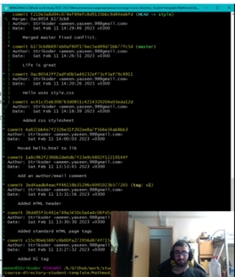{#fig:029 width=70%}

**1.23.2 Создадим клон репозитория hello**

Выполним следующие команды (рис.30):

git clone hello cloned_hello 

ls
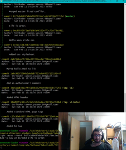{#fig:030 width=70%}

Мы видим в рабочем каталоге теперь два репозитория: оригинальный репозиторий «hello» и клонированный репозиторий «cloned_hello».

## 1.24 Просмотр клонированного репозитория

**1.24.1 Давайте взглянем на клонированный репозиторий.**

Выполним

cd cloned_hello 

ls

Мы увидим список всех файлов на верхнем уровне оригинального репозитория README.md, index.html и lib.

**1.24.2 Просмотрите историю репозитория**

Выполним git log --all. (рис.31)

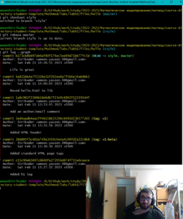{#fig:031 width=70%}

Мы увидели список всех коммитов в новый репозиторий, и он должен (более или менее) совпадать с историей коммитов в оригинальном репозитории. Мы увидели ветки со странными именами (origin/master, origin/style и origin/HEAD).

## 1.28 Слияние извлеченных изменений

**1.28.1 Слейте извлеченные изменения в локальную ветку master**

Выполним git merge origin/master.

**1.28.2 Еще раз проверьте файл README.md**

Сейчас мы должны увидеть изменения.

Выполним cat README.md.

Теперь давайте рассмотрим объединение fetch и merge в одну команду. Выполним git pull.(рис.32)

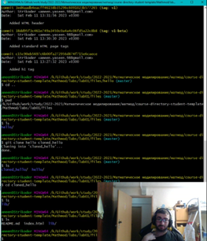{#fig:032 width=70%}

## 1.31 Добавление удаленного репозитория

Добавим репозиторий hello.git к нашему оригинальному репозиторию. Выполним (рис.33):

cd hello 

git remote add shared ../hello.git

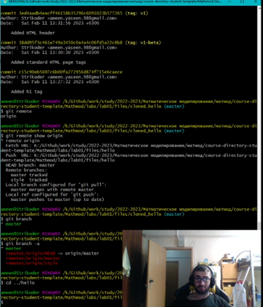{#fig:033 width=70%}

## 1.32 Отправка изменений

Файл README.md.(рис.34)

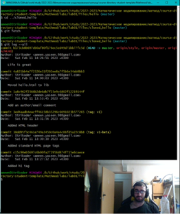{#fig:034 width=70%}

Выполним:

git checkout master 

git add README 

git commit -m "Added shared comment to readme"

И отправим изменения в общий репозиторий с помощью git push shared master.(рис.35) 

{#fig:035 width=70%}

Общим называется репозиторий, получающий отправленные нами изменения.

## 1.33 Извлечение общих изменений

Научимся извлекать изменения из общего репозитория. 

Выполним (рис.36):

cd ../cloned_hello 

git remote add shared ../hello.git 

git branch --track shared master 

git pull shared master 

cat README.md

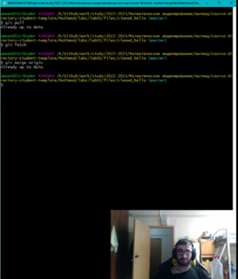

{#fig:036 width=70%}

# Выводы
В результате проделанной лабораторной работы, познакомился с работой распределённой системы управления версиям Git, а также с языком разметки Markdown

# Список литературы{.unnumbered}
Кулябов Д. С.  *Лабораторная работа №1**: git.pdf*

Кулябов Д. С.  *Лабораторная работа №1**: markdown.pdf* 