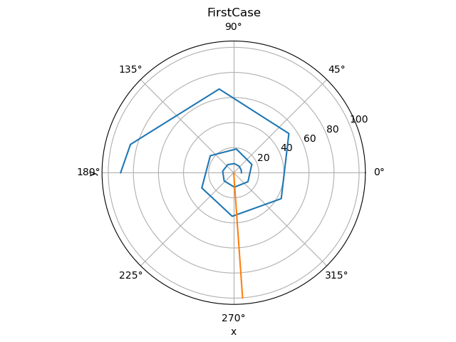
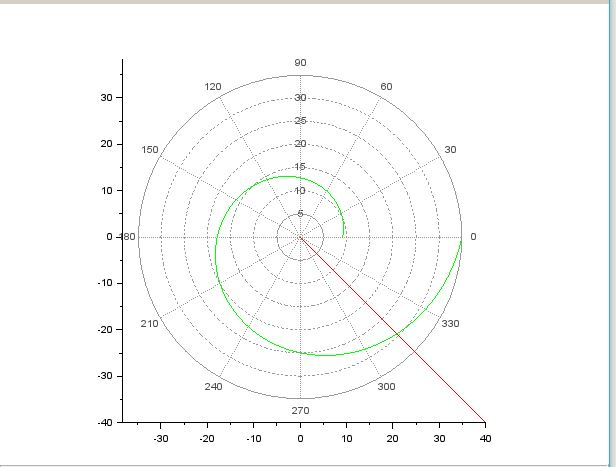

---
## Front matter
title: "lab № 2"
subtitle: "variant 55"
author: "Yassin Mohamad Alamin"

## Generic otions
lang: ru-RU
toc-title: "Julia"

## Bibliography
bibliography: bib/cite.bib
csl: pandoc/csl/gost-r-7-0-5-2008-numeric.csl

## Pdf output format
toc: true # Table of contents
toc-depth: 2
lof: true # List of figures
lot: true # List of tables
fontsize: 12pt
linestretch: 1.5
papersize: a4
documentclass: scrreprt
## I18n polyglossia
polyglossia-lang:
  name: russian
  options:
	- spelling=modern
	- babelshorthands=true
polyglossia-otherlangs:
  name: english
## I18n babel
babel-lang: russian
babel-otherlangs: english
## Fonts
mainfont: PT Serif
romanfont: PT Serif
sansfont: PT Sans
monofont: PT Mono
mainfontoptions: Ligatures=TeX
romanfontoptions: Ligatures=TeX
sansfontoptions: Ligatures=TeX,Scale=MatchLowercase
monofontoptions: Scale=MatchLowercase,Scale=0.9
## Biblatex
biblatex: true
biblio-style: "gost-numeric"
biblatexoptions:
  - parentracker=true
  - backend=biber
  - hyperref=auto
  - language=auto
  - autolang=other*
  - citestyle=gost-numeric
## Pandoc-crossref LaTeX customization
figureTitle: "Рис."
tableTitle: "Таблица"
listingTitle: "Листинг"
lofTitle: "Список иллюстраций"
lotTitle: "Список таблиц"
lolTitle: "Листинги"
## Misc options
indent: true
header-includes:
  - \usepackage{indentfirst}
  - \usepackage{float} # keep figures where there are in the text
  - \floatplacement{figure}{H} # keep figures where there are in the text
---


# Цель работы                                                                                                 

Научиться работать с Scilab, Openmodelica и Julia. Решать задачу о погоне, строить графики траектории движения.

# Теоретическая справка

Scilab — пакет прикладных математических программ, предоставляющий открытое окружение для инженерных (технических) и научных расчётов. Scilab позволяет работать с элементарными и большим числом специальных функций (Бесселя, Неймана, интегральные функции), имеет мощные средства работы с матрицами, полиномами (в том числе и символьно), производить численные вычисления (например, численное интегрирование) и решение задач линейной алгебры, оптимизации и симуляции, мощные статистические функции, а также средство для построения и работы с графиками.

# Ход работы

## 1.1 Задача № 55

На море в тумане катер береговой охраны преследует лодку браконьеров. Через определенный промежуток времени туман рассеивается, и лодка обнаруживается на расстоянии 17,8 км от катера. Затем лодка снова скрывается в тумане и уходит прямолинейно в неизвестном направлении. Известно, что скорость катера в 4,8 раза больше скорости браконьерской лодки. 

1. Запишите уравнение, описывающее движение катера, с начальными условиями для двух случаев (в зависимости от расположения катера относительно лодки в начальный момент времени). 
2. Постройте траекторию движения катера и лодки для двух случаев. 
3. Найдите точку пересечения траектории катера и лодки. 


## 1.2 Постановка задачи 

1. Пусть место нахождения лодки браконьеров в момент обнаружения:  t_0=0,x_{л0}=0 . Пусть место нахождения катера береговой охраны относительно лодки браконьеров в момент обнаружения лодки: x_{к0}=0.
2. Введем полярные координаты. Будем считать, что полюс - это точка обнаружения лодки браконьеров x_{л0} (0=x_{л0}=0) , а полярная ось r проходит через точку нахождения катера  береговой охраны.
3. Траектория катера должна быть такой, чтобы и катер, и лодка все время были на одном расстоянии от полюса, только в этом случае траектория катера пересечется с траекторией лодки. Поэтому для начала катер береговой охраны должен двигаться некоторое время прямолинейно, пока не окажется на том же расстоянии от полюса, что и лодка браконьеров. После этого катер береговой охраны должен двигаться вокруг полюса удаляясь от него с той же скоростью, что и лодка браконьеров.
4. Чтобы найти расстояние X (расстояние, после которого катер начнет двигаться вокруг полюса),
    необходимо составить простое уравнение. Пусть через время t катер и лодка окажутся на одном расстоянии x от полюса. За это время лодка пройдет x, а катер — k-x (или k+x в зависимости
    от начального положения катера относительно полюса). Время, за которое они пройдут это расстояние, вычисляется как x/v или k-x/4.8v (во втором случае k+x/4.8v). Так как время одно и то 
    же, то эти величины одинаковы. Тогда неизвестное расстояние x можно найти из следующего уравнения:x/v=(k-x)/4.8v в первом случае и x/v=(k+x)/4.8v во втором. Отсюда мы найдем два значения x_1=k/5,8 и x_2=k/3,8 , задачу будем решать для двух случаев.
    ==> $$x_1 = \frac{17.8}{5.8}, x_2 = \frac{17.8}{3.8}$$
5. После того, как катер береговой охраны окажется на одном расстоянии от полюса, что и лодка, он должен сменить прямолинейную траекторию и начать двигаться вокруг полюса, удаляясь от него со скоростью лодки v. Для этого скорость катера раскладываем на две составляющие: v_r — радиальная 
    скорость и v_τ — тангенциальная скорость. Радиальная скорость - это скорость, с которой катер 
    удаляется от полюса, v_r=dr/dt. Нам нужно, чтобы эта скорость была равна скорости лодки, поэтому полагаем dr/dt=v. Тангенциальная скорость – это линейная скорость вращения катера
    относительно полюса. Она равна произведению угловой скорости ∂θ/∂t на радиус r, v_τ=r*∂θ/∂t
    v_τ=√(Nv)^2–v2 =√N2-1*v=√22,04*v ==> dr/dΘ=r/√22,04 
6. Решение исходной задачи сводится к решению системы из двух дифференциальных уравнений. Далее, исключая из полученной системы  производную по t, переходим к одному уравнению: ∂r/∂θ
$$
\begin{equation*} 
  \begin{cases} 
    \frac{\partial r}{\partial t} = v 
    \\
    r \frac{\partial \theta}{\partial t} = \sqrt{22.04} v 
  \end{cases}
\end{equation*}
$$


## 1.3 Код

```Scilab

s=17.8;// начальное расстояние от лодки до катера   
fi=3*%pi/4;


function xt=f2(t) 
    xt=tan(fi)*t;
endfunction;


//функция, описывающая движение катера береговой охраны
function dr=f(tetha, r)
    dr=r/sqrt(22.04);
endfunction;

//случ1=0 + r0=s/5.8
r0=s/5.8;
tetha0=0;

//случае 2 
r0=s/3.8;
tetha0=-%pi; 

tetha=0:0.01:2*%pi;
r=ode(r0,tetha0,tetha,f);

t=0:1:40;

//функция, описывающая движение лодки браконьеров 
polarplot(tetha,r,style = color('green')); //построение траектории движения катера в полярных координатах
plot2d(t,f2(t),style = color('red'));

```
```Julia

using PyPlot;
using DifferentialEquations;

function myfunction(u, p, T)
return u/√(22.04)
end

const x_1 = 17.8/5.8
const x_2 = 17.8/3.8
const T = (0, 5π)

equation1 = ODEProblem(myfunction, x_1, T)
equation2 = ODEProblem(myfunction, x_2, T)

sol1 = solve(equation1,
 abstol=1e-8, 
 reltol=1e-8)
sol2 = solve(equation2,
 abstol=1e-8,
  reltol=1e-8);

polar(sol1.t, sol1.u + fill(x_1, 20))

polar(fill(-1.5, 11), collect(0: 10: 50))


polar(sol2.t, sol2.u + fill(x_2, 32))
title("FirstCase")
xlabel("x")

polar(fill(-1.5, 11), collect(0: 10: 100))
ylabel("y")

```


## 1.4 Полученные графики

Первый случай (рис.1, рис.2):



Второй случай (рис.2):




# Вывод

В ходе выполнения лабораторной работы я освоила Scilab, научилась решать задачу о погоне и строить графики, записала уравнение, описывающее движение катера, с начальными условиями для двух случаев (в зависимости от расположения катера относительно лодки в начальный момент времени),  построила траекторию движения катера и лодки для двух случаев, нашла точку пересечения траектории катера и лодки. 

# Список литературы{.unnumbered}

Кулябов Д.С ("Лабораторная работа №2"): [лабраторная работа №2](https://esystem.rudn.ru/mod/resource/view.php?id=967162)

Julia(wiki): ["link"](https://en.wikipedia.org/wiki/Julia_(programming_language))

Scilab(wiki): ["link"](https://en.wikipedia.org/wiki/Scilab)