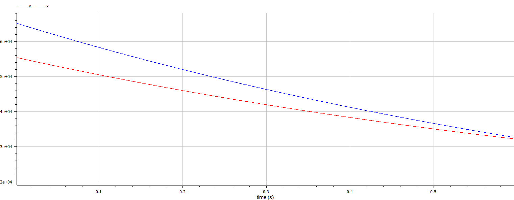
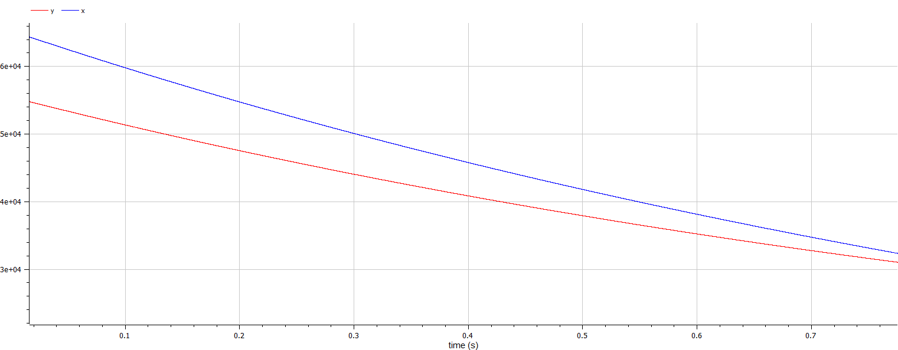
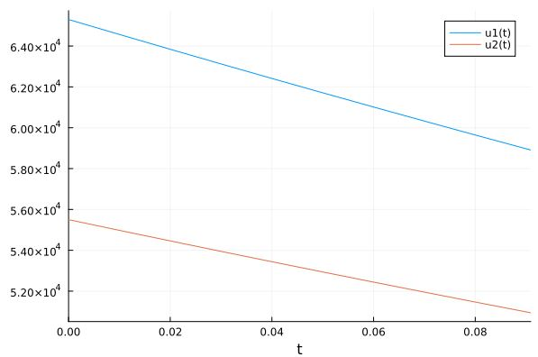
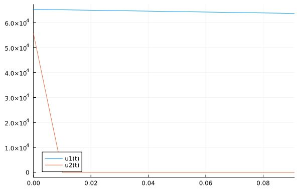

---
## Front matter
title: "Лабораторная работа №3"
subtitle: "Математическое моделировани"
author: "Яссин Мохамад Аламин"

## Generic otions
lang: ru-RU
toc-title: "Содержание"

## Bibliography
bibliography: bib/cite.bib
csl: pandoc/csl/gost-r-7-0-5-2008-numeric.csl

## Pdf output format
toc: true # Table of contents
toc-depth: 2
lof: true # List of figures
lot: true # List of tables
fontsize: 12pt
linestretch: 1.5
papersize: a4
documentclass: scrreprt
## I18n polyglossia
polyglossia-lang:
  name: russian
  options:
	- spelling=modern
	- babelshorthands=true
polyglossia-otherlangs:
  name: english
## I18n babel
babel-lang: russian
babel-otherlangs: english
## Fonts
mainfont: PT Serif
romanfont: PT Serif
sansfont: PT Sans
monofont: PT Mono
mainfontoptions: Ligatures=TeX
romanfontoptions: Ligatures=TeX
sansfontoptions: Ligatures=TeX,Scale=MatchLowercase
monofontoptions: Scale=MatchLowercase,Scale=0.9
## Biblatex
biblatex: true
biblio-style: "gost-numeric"
biblatexoptions:
  - parentracker=true
  - backend=biber
  - hyperref=auto
  - language=auto
  - autolang=other*
  - citestyle=gost-numeric
## Pandoc-crossref LaTeX customization
figureTitle: "Рис."
tableTitle: "Таблица"
listingTitle: "Листинг"
lofTitle: "Список иллюстраций"
lotTitle: "Список таблиц"
lolTitle: "Листинги"
## Misc options
indent: true
header-includes:
  - \usepackage{indentfirst}
  - \usepackage{float} # keep figures where there are in the text
  - \floatplacement{figure}{H} # keep figures where there are in the text
---


# Цель работы                                                                                                 

Рассмотреть простейшую модель боевых действий – модель Ланчестера.

# Теоретическая справка

Модель Ланчестера. В противоборстве могут принимать участие как регулярные войска, так и партизанские отряды. В общем случае главной характеристикой соперников являются численности сторон. Если в какой-то момент времени одна из численностей обращается в нуль, то данная сторона считается проигравшей (при условии, что численность другой стороны в данный момент положительна).

В этой работе ассмотри три случая ведения боевых действий: 

1. Боевые действия между регулярными войсками. 

2.  Боевые действия с участием регулярных войск и партизанских отрядов. 

3.  Боевые действия между партизанскими отрядами. 


# Выполнение работы вариант 55

Между страной Х и страной У идет война. Численность состава войск
исчисляется от начала войны, и являются временными функциями( )x t и( )y t . В
начальный момент времени страна Х имеет армию численностью 65300 человек, а
в распоряжении страны У армия численностью в 55500 человек. Для упрощения
модели считаем, что коэффициенты, , ,a b c h постоянны. Также считаем( )P t и( )Q t
непрерывные функции.
Постройте графики изменения численности войск армии Х и армии У для
следующих случаев:
1. Модель боевых действий между регулярными войсками
$$\frac{dx}{dt} = -0.67x - 0.54y + \sin(5t) + 1$$

$$\frac{dy}{dt} = -0.491x - 0.37y + \cos(5t) + 1$$

2. Модель ведение боевых действий с участием регулярных войск и партизанских отрядов 


$$\frac{dx}{dt} = -0.278t - 0.701t + \left|\sin(2t)\right|$$
$$\frac{dy}{dt} = -0.502ty - 0.188t + \left|\cos(12t)\right|$$


1. Боевые действия между регулярными войсками

2. Боевые действия с участием регулярных войск и партизанских отрядов 

3. Боевые действия между партизанскими отрядами

   В первом случае численность регулярных войск определяется тремя факторами: 

   скорость уменьшения численности войск из-за причин, не связанных с боевыми действиями (болезни, травмы, дезертирство); 

   скорость потерь, обусловленных боевыми действиями противоборствующих сторон (что связанно с качеством стратегии, уровнем вооружения, профессионализмом солдат и т.п.); 

   скорость поступления подкрепления (задаётся некоторой функцией от времени). 

   

В этом случае модель боевых действий между регулярными войсками описывается следующим образом

$$\frac{dx}{dt} = -a(t)x(t)-b(t)y(t)+P(t);$$
$$\frac{dy}{dt} = -c(t)x(t)-h(t)y(t)+Q(t)$$


Потери, не связанные с боевыми действиями, описывают члены -a(t)x(t) и -h(t)y(t) , члены -b(t)y(t) и -c(t)x(t) отражают потери на поле боя. Коэффициенты b(t) и c(t) указывают на эффективность боевых действий со стороны у и х соответственно, a(t), h(t) - величины, характеризующие степень влияния различных факторов на потери. Функции P(t), Q(t) учитывают  возможность подхода подкрепления к войскам Х и У в течение одного дня.

Во втором случае в борьбу добавляются партизанские отряды. Нерегулярные войска в отличии от постоянной армии менее уязвимы, так как действуют скрытно, в этом случае сопернику приходится действовать неизбирательно, по площадям, занимаемым партизанами. Поэтому считается, что тем потерь партизан, проводящих свои операции в разных местах на некоторой известной территории, пропорционален не только численности армейских соединений, но и численности самих партизан. В результате модель принимает вид (в этой системе все величины имею тот же смысл):

$$\frac{dx}{dt} = -a(t)x(t)-b(t)y(t)+P(t);$$
$$\frac{dy}{dt}= -c(t)x(t)y(t)-h(t)y(t)+Q(t)$$


**Code open modelica**

```
model case1
Parameter Real a=0.67;
Parameter Real b= 0.54;
Parameter Real c=0.491;
Parameter Real h=0.37;

Parameter Real x0=65300
Parameter Real y0=55500

equation
	der(x)= -a*x - b*y + sin(5*time)+1
	der(y)= -c*x - h*y + cos(5*time)+1

end case1;

model case2
Parameter Real a=0.278;
Parameter Real b= 0.701;
Parameter Real c=0.502;
Parameter Real h=0.188;

Parameter Real x0=65300
Parameter Real y0=55500

equation
	der(x)= -a*x - b*y + abs(sin(2*time))
	der(y)= -c*x*y - h*y + abs(cos(12*time))

end case 2

```

Получили 2 графики:
(рис.1):

{#fig:001 width=70%}

(рис.2):
{#fig:002 width=70%}

**Code Julia**

```
using Plots
using DifferentialEquations
x0 = 65300
y0 = 55500
t0 = 0
tmax =0.1

a=0.67;
b= 0.54;
c=0.491;
h=0.37;

a2=0.278;
b2= 0.701;
c2=0.502;
h2=0.188;
function P(t)
return sin(5*t)+1
end
function Q(t)
return cos(5*t)+1
end
function P2(t)
return abs(sin(2*t))
end
function Q2(t)
return abs(cos(12*t))
end

function syst(dy, y, p, t)
dy[1] = -a*y[1] - b*y[2] + P(t)
dy[2] = -c*y[1] - h*y[2] + Q(t)
end
function syst2(dy, y, p, t)
dy[1] = -a2*y[1] - b2*y[2] + P2(t)
dy[2] = -c2*y[1]*y[2] - h2*y[2] + Q2(t)
end
u0 = [x0; y0]
tspan = (t0, tmax)
t = collect(LinRange(0, 1, 100))
prob = ODEProblem(syst, u0, tspan)
sol = solve(prob, saveat=t)
prob2 = ODEProblem(syst2, u0, tspan)
sol2 = solve(prob2, saveat=t)
plot(sol)
plot(sol2)


```
Получили 2 графики:
(рис.3):

{#fig:003 width=70%}

(рис.4):
{#fig:004 width=70%}

# Вывод

В ходе выполнения лабораторной работы я рассмотрел и построил простейшую модель боевых действий – модель Ланчестера.


# Список литературы

Кулябов Д. С.  *Лабораторная работа №3* [@lab-report-number-3].

Julia wiki page [@julia-lang].