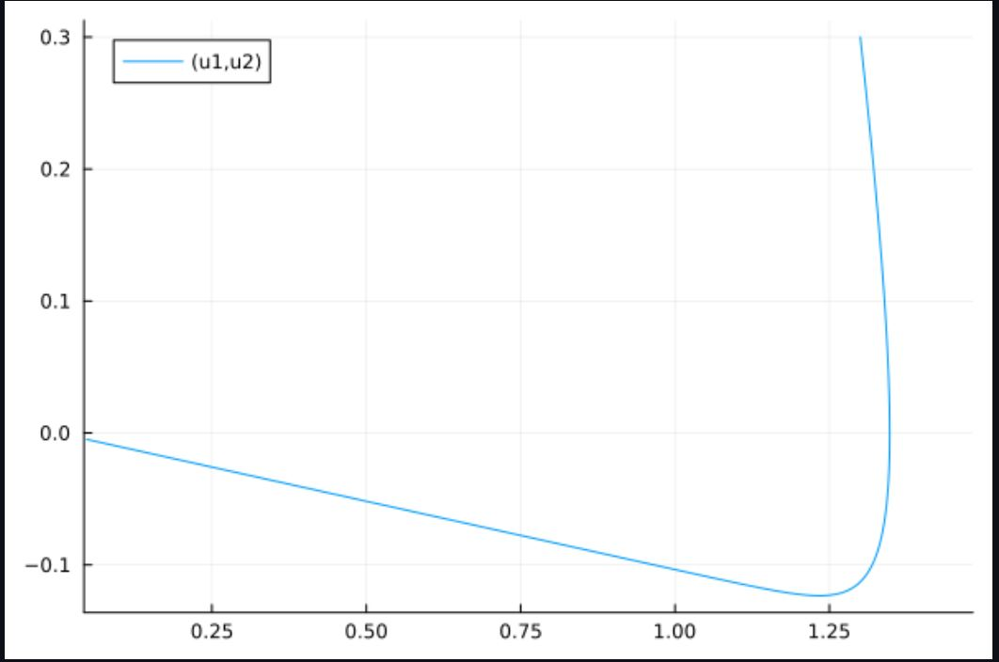

---
## Front matter
lang: ru-RU
title: Лабораторная работа №4
subtitle: Моделями гармонических колебаний
author:
  - Яссин Мохамад Аламин
institute:
  - Российский университет дружбы народов, Москва, Россия
date: 04 Матра 2023

## i18n babel
babel-lang: russian
babel-otherlangs: english

## Formatting pdf
toc: false
toc-title: Содержание
slide_level: 2
aspectratio: 169
section-titles: true
theme: metropolis
header-includes:
 - \metroset{progressbar=frametitle,sectionpage=progressbar,numbering=fraction}
 - '\makeatletter'
 - '\beamer@ignorenonframefalse'
 - '\makeatother'
---

## Прагматика выполнения

- Познакомиться с моделями гармонических колебаний с затуханием и без затухания, под действием внешних сил и без действия внешних сил

- Научиться строить фазовые портреты с помощью OpenModelica

- Применение полученных знаний на практике в дальнейшем

  

## Цели

- Научиться работать с OpenModelica

- Построить фазовый портрет гармонического осциллятора

- Решить уравнения гармонического осциллятора

- Получение новых знаний в ходе выполнения лабораторной работы

  

## Определение гармонических колебаний 

Гармонические колебания — колебания, при которых физическая величина изменяется с течением времени по гармоническому (синусоидальному, косинусоидальному) закону.

## Задание

Постройте фазовый портрет гармонического осциллятора и решение уравнения гармонического осциллятора для следующих случаев:

1.Колебания гармонического осциллятора без затуханий и без действий внешней силы 
$$
\ddot{x}+8.8x=0
$$
2.Колебания гармонического осциллятора c затуханием и без действий внешней силы 
$$
\ddot{x}+4.7\dot{x}+2.8x=0
$$

3.Колебания гармонического осциллятора c затуханием и под действием внешней силы 
$$
\ddot{x}+5\dot{x}+4x=3cos(0.7t)
$$
На интервале 
$$
t\in [0,57]
$$
(шаг 0,05) с начальными условиями 
$$
x_0=0,8,y_0=0,9
$$

## Полученный график для случая 1

  

## Полученный график для случая 2

  

## Полученный график для случая 3

  

## Результаты лабораторной работы

- Мы научились работать в OpenModelica

- Научились решать уравнения гармонического осциллятора

- Научились строить фазовые портреты 

  
  

    
  
    
  
    
  
    ### 
Спасибо за внимание!

