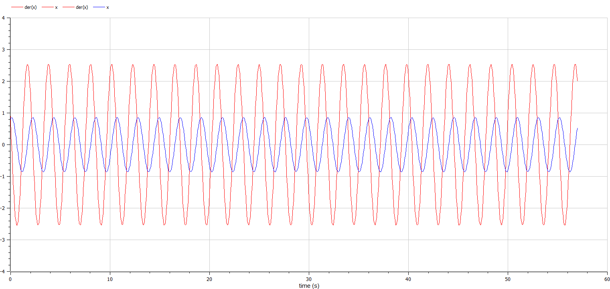
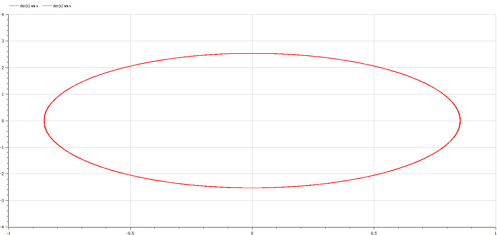
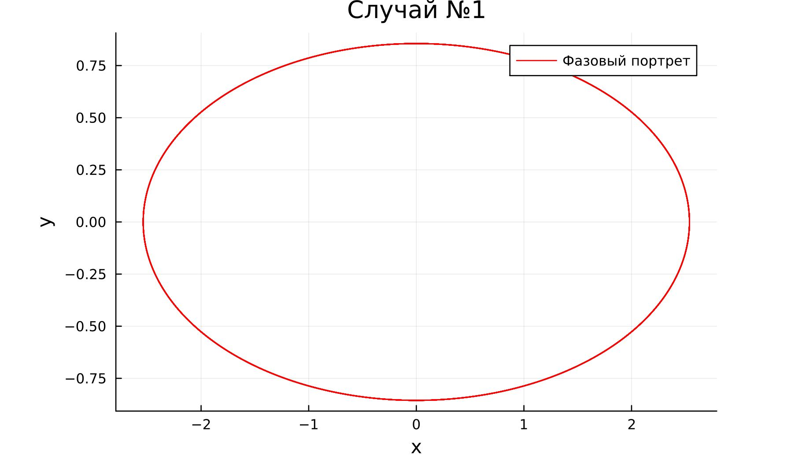
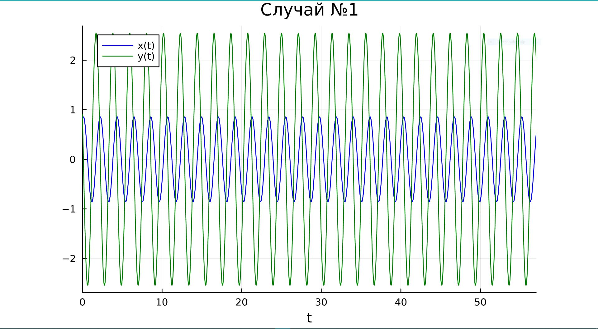
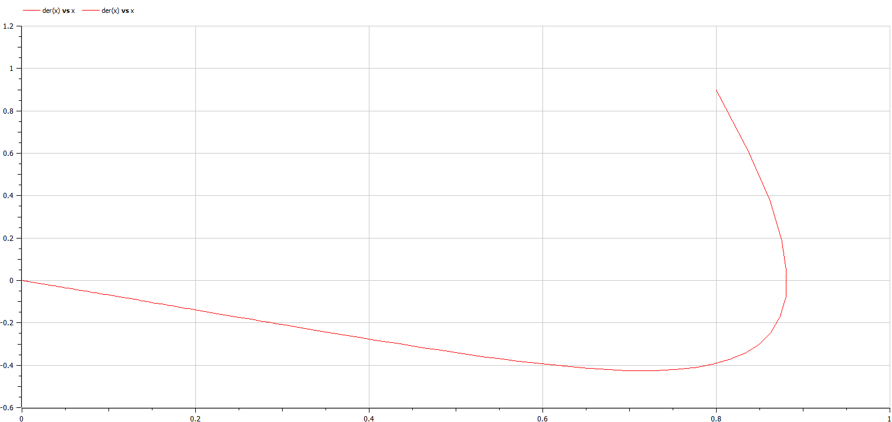
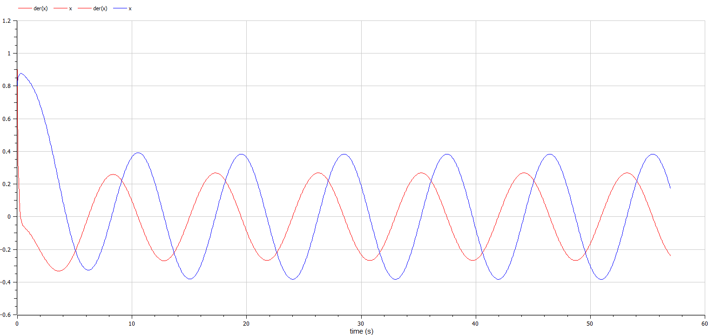
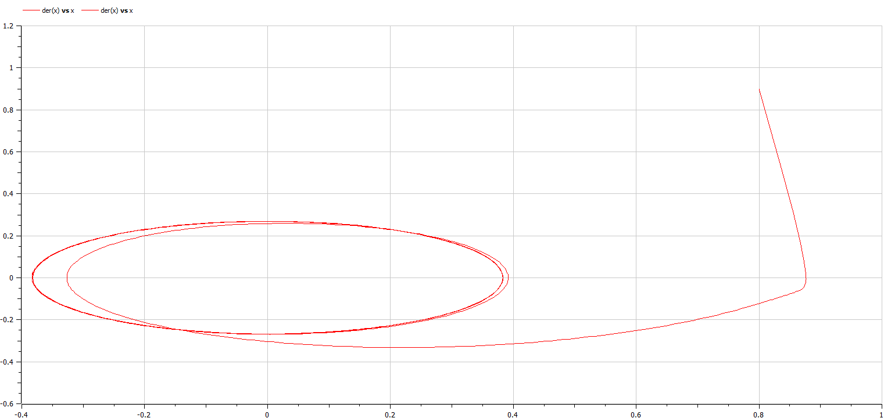

---
## Front matter
title: "Лабораторная работа №4"
subtitle: "Отчет по Лабораторной работе "
author: "Яссин Мохамад Аламин"

## Generic otions
lang: ru-RU
toc-title: "Содержание"

## Bibliography
bibliography: bib/cite.bib
csl: pandoc/csl/gost-r-7-0-5-2008-numeric.csl

## Pdf output format
toc: true # Table of contents
toc-depth: 2
lof: true # List of figures
lot: true # List of tables
fontsize: 12pt
linestretch: 1.5
papersize: a4
documentclass: scrreprt
## I18n polyglossia
polyglossia-lang:
  name: russian
  options:
	- spelling=modern
	- babelshorthands=true
polyglossia-otherlangs:
  name: english
## I18n babel
babel-lang: russian
babel-otherlangs: english
## Fonts
mainfont: PT Serif
romanfont: PT Serif
sansfont: PT Sans
monofont: PT Mono
mainfontoptions: Ligatures=TeX
romanfontoptions: Ligatures=TeX
sansfontoptions: Ligatures=TeX,Scale=MatchLowercase
monofontoptions: Scale=MatchLowercase,Scale=0.9
## Biblatex
biblatex: true
biblio-style: "gost-numeric"
biblatexoptions:
  - parentracker=true
  - backend=biber
  - hyperref=auto
  - language=auto
  - autolang=other*
  - citestyle=gost-numeric
## Pandoc-crossref LaTeX customization
figureTitle: "Рис."
tableTitle: "Таблица"
listingTitle: "Листинг"
lofTitle: "Список иллюстраций"
lotTitle: "Список таблиц"
lolTitle: "Листинги"
## Misc options
indent: true
header-includes:
  - \usepackage{indentfirst}
  - \usepackage{float} # keep figures where there are in the text
  - \floatplacement{figure}{H} # keep figures where there are in the text
---

# Цель работы

Изучить уравнение гармонического осцилятора

# Задание

1.	Построить решение уравнения гармонического осциллятора без затухания
2.	Записать уравнение свободных колебаний гармонического осциллятора с затуханием, построить его решение. Построить фазовый портрет гармонических колебаний с затуханием.
3.	Записать уравнение колебаний гармонического осциллятора, если на систему действует внешняя сила, построить его решение. Построить фазовый портрет колебаний с действием внешней силы.


# Выполнение лабораторной работы

## Теоретические сведения


Движение грузика на пружинке, маятника, заряда в электрическом контуре, а также эволюция во времени многих систем в физике, химии, биологии и других науках при определенных предположениях можно описать одним и тем же дифференциальным уравнением, которое в теории колебаний выступает в качестве основной модели. Эта модель называется линейным гармоническим осциллятором.
Уравнение свободных колебаний гармонического осциллятора имеет следующий вид:
$$\ddot{x}+2\gamma\dot{x}+\omega_0^2=0$$

где $x$ - переменная, описывающая состояние системы (смещение грузика, заряд конденсатора и т.д.), $\gamma$ - параметр, характеризующий потери энергии (трение в механической системе, сопротивление в контуре), $\omega_0$ - собственная частота колебаний.
Это уравнение есть линейное однородное дифференциальное  уравнение второго порядка и оно является примером линейной динамической системы.

При отсутствии потерь в системе ( $\gamma=0$ ) получаем уравнение консервативного осциллятора энергия колебания которого сохраняется во времени.
$$\ddot{x}+\omega_0^2x=0$$

Для однозначной разрешимости уравнения второго порядка необходимо задать два начальных условия вида
 
$$
 \begin{cases}
	x(t_0)=x_0
	\\   
	\dot{x(t_0)}=y_0
 \end{cases}
$$

Уравнение второго порядка можно представить в виде системы двух уравнений первого порядка:
$$
 \begin{cases}
	x=y
	\\   
	y=-\omega_0^2x
 \end{cases}
$$

Начальные условия для системы примут вид:
$$
 \begin{cases}
	x(t_0)=x_0
	\\   
	y(t_0)=y_0
 \end{cases}
$$

Независимые	переменные	$x, y$	определяют	пространство,	в	котором «движется» решение. Это фазовое пространство системы, поскольку оно двумерно будем называть его фазовой плоскостью.
Значение фазовых координат $x, y$ в любой момент времени полностью определяет состояние системы. Решению уравнения движения как функции времени отвечает гладкая кривая в фазовой плоскости. Она называется фазовой траекторией. Если множество различных решений (соответствующих различным 
начальным условиям) изобразить на одной фазовой плоскости, возникает общая картина поведения системы. Такую картину, образованную набором фазовых траекторий, называют фазовым портретом.


## Задача

Постройте фазовый портрет гармонического осциллятора и решение уравнения гармонического осциллятора для следующих случаев 

1. Колебания гармонического осциллятора без затуханий и без действий внешней
силы $\ddot{x}+8.8x=0$
2. Колебания гармонического осциллятора c затуханием и без действий внешней
силы $\ddot{x}+7.7\dot{x}+2.8x=0$
3. Колебания гармонического осциллятора c затуханием и под действием внешней
силы $\ddot{x}+5\dot{x}+4x=3\cos{0.7t}$

На итнтервале $t \in [ 0;57 ]$, шаг 0.05, $x_0=0.8, y_0=0.9$


1. В системе отсутствуют потери энергии (колебания без затухания)
Получаем уравнение 
$$\ddot{x}+\omega_0^2x=0$$

Переходим к двум дифференциальным уравнениям первого порядка:
$$
 \begin{cases}
	\dot{x}=y
	\\   
	\dot{y}=-\omega_0^2x
 \end{cases}
$$

Решение в OpenModelica

```
model project
constant Real w=sqrt(8.8);//значение параметра омега
Real x;//переменная x
Real y;//переменная y
initial equation
x=0.8;//начальное значение
y=0.9;//начальное значение
equation 
der(x)=y;//уравнение системы
der(y)=-w*w*x;//уравнение системы
end project;

```


Решение в Julia

```
#1-ый случ
using Plots
using DifferentialEquations

const x0 = 0.8
const y0 = 0.9
const omega = 8,8
const gamma = 0

P(t) = 3*cos(0.7*t)

T = (0, 57)

u0 = [x0, y0]

p1 = (omega)
p2 = (omega, gamma)

function F1(du, u, p, t)
    omega = p
    du[1] = u[2]
    du[2] = -omega*u[1]
end

prob1 = ODEProblem(F1, u0, T, p1)
sol1 = solve(prob1, dtmax=0.05)

plt = plot(sol1, vars=(2,1), color=:red, label="Фазовый портрет", title="Случай №1", xlabel="x", ylabel="y")

plt2 = plot(sol1, vars=(0,1), color=:blue, label="x(t)", title="Случай №1", xlabel="t")
plot!(plt2, sol1, vars=(0,2), color=:green, label="y(t)")
```
{ #fig:001 width=70% height=70% }

{ #fig:002 width=70% height=70% }

{ #fig:003 width=70% height=70% }

{ #fig:004 width=70% height=70% }

2.  В системе присутствуют потери энергии (колебания с затуханием)
Получаем уравнение 
$$\ddot{x}+2\gamma\dot{x}+\omega_0^2x=0$$

Переходим к двум дифференциальным уравнениям первого порядка:
$$
 \begin{cases}
	\dot{x}=y
	\\   
	\dot{y}=-2\gamma y-\omega_0^2x
 \end{cases}
$$

Решение в OpenModelica

```
model project
constant Real w=sqrt(2.8);//значение параметра омега
constant Real g=(4.7/2);//значение параметра гамма
Real x;//переменная x 
Real y;//переменная y
initial equation 
x=0.8;//начальное значение
y=0.9;//начальное значение 
equation
der(x)=y;//уравнение системы 
der(y)=-2*g*der(x)-w*w*x;//уравнение системы
end project;
```


Решение в Julia

```
const omega = 2,8
const gamma = 4,7
function F2(du, u, p, t)
    omega, gamma = p
    du[1] = u[2]
    du[2] = -gamma*du[1]-omega*u[1]
end

prob2 = ODEProblem(F2, u0, T, p2)
sol2 = solve(prob2, dtmax=0.05)

plt = plot(sol2, vars=(2,1), color=:red, label="Фазовый портрет", title="Случай №2", xlabel="x", ylabel="y")

plt2 = plot(sol2, vars=(0,1), color=:blue, label="x(t)", title="Случай №2", xlabel="t")

plot!(plt2, sol2, vars=(0,2), color=:green, label="y(t)")
```

{ #fig:005 width=70% height=70% }

{ #fig:006 width=70% height=70% }


3. На систему действует внешняя сила.
Получаем уравнение 
$$\ddot{x}+2\gamma\dot{x}+\omega_0^2x=F(t)$$

Переходим к двум дифференциальным уравнениям первого порядка:
$$
 \begin{cases}
	\dot{x}=y
	\\   
	\dot{y}=F(t)-2\gamma y-\omega_0^2x
 \end{cases}
$$

Решение в OpenModelica

```
parameter Real w = 4;
parameter Real g = 5;
Real x(start=0.8);
Real y(start=0.9);

equation
  der(x) = y;
  der(y) = -2*g*y - w*x + 3*cos(0.7*time);

```


Решение в Julia

```
const omega = 4
const gamma = 5
function F3(du, u, p, t)
    omega, gamma = p
    du[1] = u[2]
    du[2] = P(t)-gamma*du[1]-omega*u[1]
end

prob3 = ODEProblem(F3, u0, T, p2)
sol3 = solve(prob3, dtmax=0.05)

plt = plot(sol3, vars=(2,1), color=:red, label="Фазовый портрет", title="Случай №3", xlabel="x", ylabel="y")
plt2 = plot(sol3, vars=(0,1), color=:blue, label="x(t)", title="Случай №3", xlabel="t")
plot!(plt2, sol3, vars=(0,2), color=:green, label="y(t)")
```

{ #fig:007 width=70% height=70% }

{ #fig:008 width=70% height=70% }


# Выводы

В ходе выполнения лабораторной работы были построены решения уравнения гармонического осциллятора и фазовые портреты гармонических колебаний без затухания, с затуханием и при действии внешней силы.


# Список литературы{.unnumbered}

Кулябов Д. С. Лабораторная работа №3 [@lab-report-number-3].

Julia wiki page [@julia-lang].