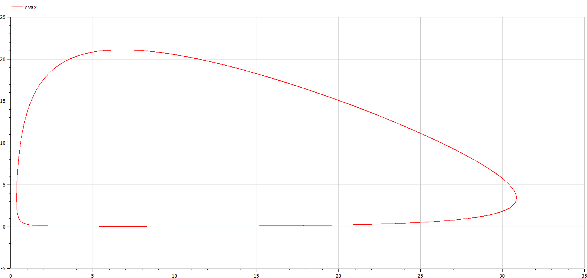

---
## Front matter
lang: ru-RU
title: Отчет по лабораторной работе № 5
subtitle: Вариант №55
author:
  - Яссин Мохамад Аламин
institute:
  - Российский университет дружбы народов, Москва, Россия
date: 11.03.2023

## i18n babel
babel-lang: russian
babel-otherlangs: english

## Formatting pdf
toc: false
toc-title: Содержание
slide_level: 2
aspectratio: 169
section-titles: true
theme: metropolis
header-includes:
 - \metroset{progressbar=frametitle,sectionpage=progressbar,numbering=fraction}
 - '\makeatletter'
 - '\beamer@ignorenonframefalse'
 - '\makeatother'
---

# 
Лабораторная работа №5

**Автор: Яссин Мохамад Аламин**

**Группа: НКНбд-01-20**

## Прагматика выполнения

- Познакомиться с моделью Лотки-Вольтерры

- Научиться строить фазовый портрет системы с помощью OpenModelica

- Применение полученных знаний на практике в дальнейшем

  

## Цели

- Научиться работать с OpenModelica

- Построить график зависимости численности хищников от численности жертв

- Построить графики изменения численности хищников и численности жертв при заданных начальных условиях

- Найти стационарное состояние системы

- Получение новых знаний в ходе выполнения лабораторной работы

  

## Что такое модель Лотки-Вольтерры?

Модель Лотки-Вольтерры — модель взаимодействия двух видов типа «хищник — жертва», названная в честь её авторов, которые предложили модельные уравнения независимо друг от друга. Такие уравнения можно использовать для моделирования систем «хищник — жертва», «паразит — хозяин», конкуренции и других видов взаимодействия между двумя видами.

## Задание

Для модели «хищник-жертва»: 
$$
dx/dt=-0,14x(t)+0,041x(t)y(t);dy/dt=0,23y(t)-0,0034x(t)y(t)
$$
Постройте график зависимости численности хищников от численности жертв, а также графики изменения численности хищников и численности жертв при следующих начальных условиях: 
$$
x_0=8,y_0=21
$$
Найдите стационарное состояние системы.

## Полученные графики

  

## Результаты лабораторной работы

- Мы научились работать в OpenModelica

- Научились строить график зависимости численности хищников от численности жертв

- Научились строить графики изменения численности хищников и численности жертв при заданных начальных условиях 

- Научились находить стационарное состояние системы

  
  

    
  
    
  
    
  
    ### 
Спасибо за внимание!

