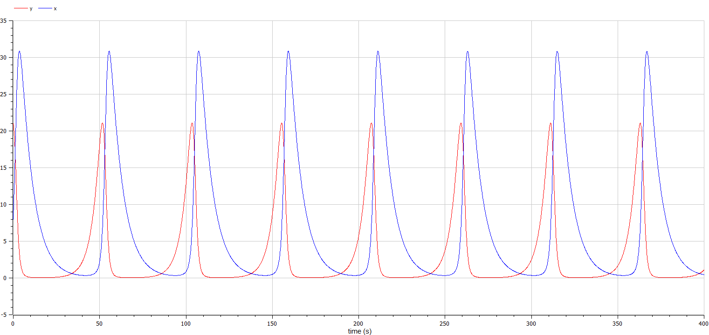
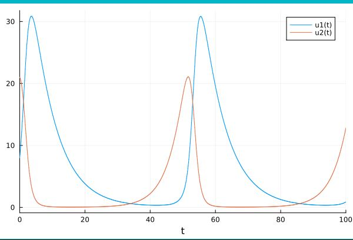
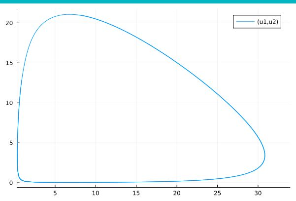

---
## Front matter
title: "Отчет по лабораторной работе №5"
subtitle: "Модель хищник-жертва - вариант 55"
author: "Яссин Мохамад Аламин"

## Generic otions
lang: ru-RU
toc-title: "Содержание"

## Bibliography
bibliography: bib/cite.bib
csl: pandoc/csl/gost-r-7-0-5-2008-numeric.csl

## Pdf output format
toc: true # Table of contents
toc-depth: 2
lof: true # List of figures
lot: true # List of tables
fontsize: 12pt
linestretch: 1.5
papersize: a4
documentclass: scrreprt
## I18n polyglossia
polyglossia-lang:
  name: russian
  options:
	- spelling=modern
	- babelshorthands=true
polyglossia-otherlangs:
  name: english
## I18n babel
babel-lang: russian
babel-otherlangs: english
## Fonts
mainfont: PT Serif
romanfont: PT Serif
sansfont: PT Sans
monofont: PT Mono
mainfontoptions: Ligatures=TeX
romanfontoptions: Ligatures=TeX
sansfontoptions: Ligatures=TeX,Scale=MatchLowercase
monofontoptions: Scale=MatchLowercase,Scale=0.9
## Biblatex
biblatex: true
biblio-style: "gost-numeric"
biblatexoptions:
  - parentracker=true
  - backend=biber
  - hyperref=auto
  - language=auto
  - autolang=other*
  - citestyle=gost-numeric
## Pandoc-crossref LaTeX customization
figureTitle: "Рис."
tableTitle: "Таблица"
listingTitle: "Листинг"
lofTitle: "Список иллюстраций"
lotTitle: "Список таблиц"
lolTitle: "Листинги"
## Misc options
indent: true
header-includes:
  - \usepackage{indentfirst}
  - \usepackage{float} # keep figures where there are in the text
  - \floatplacement{figure}{H} # keep figures where there are in the text
---

# Цель работы

Изучить модель хищник-жертва

# Задание

1.	Построить график зависимости $x$ от $y$ и графики функций $x(t)$, $y(t)$
2.	Найти стационарное состояние системы


# Выполнение лабораторной работы

## Теоретические сведения

В данной лабораторной работе рассматривается математическая модель системы «Хищник-жертва». 

Рассмотрим базисные компоненты системы. 
Пусть система имеет $X$ хищников и $Y$ жертв. И пусть для этой системы выполняются следующие предположения: (Модель Лотки-Вольтерра)
1.	Численность популяции жертв и хищников зависят только от времени (модель не учитывает пространственное распределение популяции на занимаемой территории) 
2.	В отсутствии взаимодействия численность видов изменяется по модели Мальтуса, при этом число жертв увеличивается, а число хищников падает 
3.	Естественная смертность жертвы и естественная рождаемость хищника считаются несущественными 
4.	Эффект насыщения численности обеих популяций не учитывается 
5.	Скорость роста численности жертв уменьшается пропорционально численности хищников:

$$
 \begin{cases}
	\frac{dx}{dt} = (-ax(t) + by(t)x(t))
	\\   
	\frac{dy}{dt} = (cy(t) - dy(t)x(t))
 \end{cases}
$$

Параметр $a$ определяет коэффициент смертности хищников, $b$ – коэффициент естественного прироста хищников, $c$ – коэффициент прироста жертв и $d$ – коэффициент смертности жертв

В зависимости от этих параметрах система и будет изменяться. Однако следует выделить одно важное состояние системы, при котором не происходит никаких изменений как со стороны хищников, так и со стороны жертв. Это, так называемое, стационарное состояние системы. При нем, как уже было отмечено, изменение численности популяции равно нулю.
Следовательно, при отсутствии изменений в системе $\frac{dx}{dt} = 0, \frac{dy}{dt} = 0$

Пусть по условию есть хотя бы один хищник и хотя бы одна жертва: $x>0, y>0$
Тогда стационарное состояние системы определяется следующим образом: 
$$
	x_0=\frac{a}{b}, y_0=\frac{c}{d}
$$

## Задача

Для модели «хищник-жертва»:

$$
 \begin{cases}
	\frac{dx}{dt} = -0.14x(t) + 0.041y(t)x(t)
	\\   
	\frac{dy}{dt} = 0.23y(t) - 0.034y(t)x(t)
 \end{cases}
$$

Постройте график зависимости численности хищников от численности жертв, а также графики изменения численности хищников и численности жертв 
при следующих начальных условиях: $x_0=8, y_0=21$
Найдите стационарное состояние системы

Code OpenModelica

```
model pr5

Real x(start=8);
Real y(start=21);

parameter Real a=0.14;
parameter Real b=0.041;
parameter Real c=0.23;
parameter Real d=0.034;

equation
  der(x) = -a*x + b*x*y;
  der(y) = c*y - d*x*y;
  
end pr5;

```

{ #fig:001 width=70% height=70% }

{ #fig:002 width=70% height=70% }

Code Julia


```
using Plots
using DifferentialEquations

x0 = 8
y0 = 21
u0 = [x0; y0]

t0 = 0
tmax = 100
tspan = (t0, tmax)
t = collect(LinRange(t0, tmax, 1000))
    
a = 0.14
b = 0.041
c = 0.23
d = 0.034

function syst(dy, y, p, t)
    dy[1] = -a*y[1] + b*y[1]*y[2]
    dy[2] = c*y[2] - d*y[1]*y[2]
end

prob = ODEProblem(syst, u0, tspan)

sol = solve(prob, saveat = t)

plot(sol)

plot(sol, idxs=(1, 2))


```

{ #fig:003 width=70% height=70% }

{ #fig:004 width=70% height=70% }

# Выводы

В ходе выполнения лабораторной работы была изучена модель хищник-жертва и построены графики.
# Список литературы{.unnumbered}

[@lab-report-number-5].

[@julia-lang].