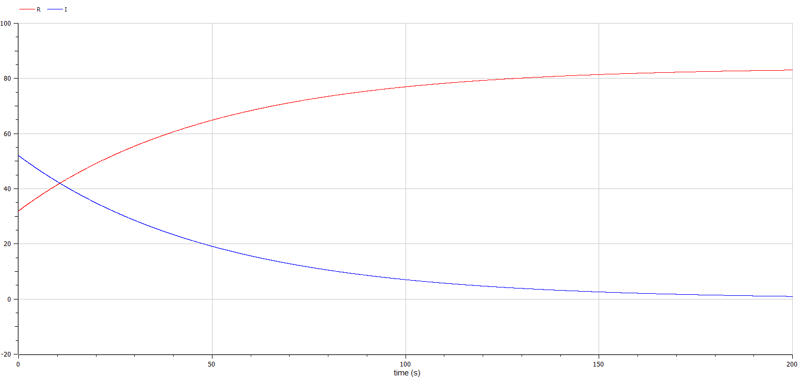
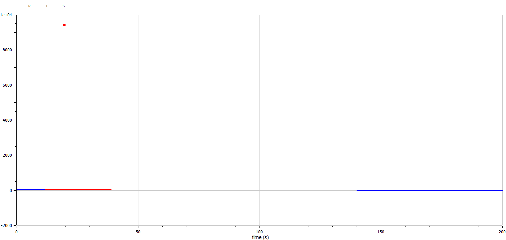

---
## Front matter
title: "Отчет по лабораторной работе №6"
subtitle: "Модель эпидемии - вариант 55"
author: "Яссин мохмад аламин"

## Generic otions
lang: ru-RU
toc-title: "Содержание"

## Bibliography
bibliography: bib/cite.bib
csl: pandoc/csl/gost-r-7-0-5-2008-numeric.csl

## Pdf output format
toc: true # Table of contents
toc-depth: 2
lof: true # List of figures
lot: true # List of tables
fontsize: 12pt
linestretch: 1.5
papersize: a4
documentclass: scrreprt
## I18n polyglossia
polyglossia-lang:
  name: russian
  options:
	- spelling=modern
	- babelshorthands=true
polyglossia-otherlangs:
  name: english
## I18n babel
babel-lang: russian
babel-otherlangs: english
## Fonts
mainfont: PT Serif
romanfont: PT Serif
sansfont: PT Sans
monofont: PT Mono
mainfontoptions: Ligatures=TeX
romanfontoptions: Ligatures=TeX
sansfontoptions: Ligatures=TeX,Scale=MatchLowercase
monofontoptions: Scale=MatchLowercase,Scale=0.9
## Biblatex
biblatex: true
biblio-style: "gost-numeric"
biblatexoptions:
  - parentracker=true
  - backend=biber
  - hyperref=auto
  - language=auto
  - autolang=other*
  - citestyle=gost-numeric
## Pandoc-crossref LaTeX customization
figureTitle: "Рис."
tableTitle: "Таблица"
listingTitle: "Листинг"
lofTitle: "Список иллюстраций"
lotTitle: "Список таблиц"
lolTitle: "Листинги"
## Misc options
indent: true
header-includes:
  - \usepackage{indentfirst}
  - \usepackage{float} # keep figures where there are in the text
  - \floatplacement{figure}{H} # keep figures where there are in the text
---


# Цель работы

Рассмотреть простейшую модель эпидемии. Построить модель и визуализировать график изменения числа особей.

# Задание
Вариант 55

На одном острове вспыхнула эпидемия. Известно, что из всех проживающих на острове $(N=9512)$ в момент начала эпидемии $(t=0)$ число заболевших людей (являющихся распространителями инфекции) $I(0)=52$, А число здоровых людей с иммунитетом к болезни $R(0)=32$. Таким образом, число людей восприимчивых к болезни, но пока здоровых, в начальный момент времени $S(0)=N-I(0)- R(0)$.

Постройте графики изменения числа особей в каждой из трех групп. Рассмотрите, как будет протекать эпидемия в случае: 

1. если $I(0) \leq I^*$.
2. если $I(0)>I^*$. 

# Теоретическое введение

Предположим, что некая популяция, состоящая из N особей, (считаем, что популяция изолирована) подразделяется на три группы.

- S(t) — восприимчивые к болезни, но пока здоровые особи
- I(t) — это число инфицированных особей, которые также при этом являются распространителями инфекции
- R(t) — это здоровые особи с иммунитетом к болезни.

До того, как число заболевших не превышает критического значения I считаем, что все больные изолированы и не заражают здоровых. Когда I(t)>I*, тогда инфицирование способны заражать восприимчивых к болезни особей.

Таким образом, скорость изменения числа S(t) меняется по следующему закону:
$$
 \frac{\partial S}{\partial t} = \begin{cases} - \alpha S, если \ I(t)>I^* \\ 0, если \ I(t) \leq I^* \end{cases}
$$
Поскольку каждая восприимчивая к болезни особь, которая, в конце концов, заболевает, сама становится инфекционной, то скорость изменения числа инфекционных особей представляет разность за единицу времени между заразившимися и теми, кто уже болеет и лечится, т.е.:
$$
 \frac{\partial I}{\partial t} = \begin{cases} \alpha S - \beta I, если \ I(t)>I^* \\  - \beta I, если \ I(t) \leq I^* \end{cases}
$$
А скорость изменения выздоравливающих особей (при этом приобретающие иммунитет к болезни)
$$
\frac{\partial R}{\partial t} = \beta I
$$
Постоянные пропорциональности:

- $$
  \alpha — коэффициент заболеваемости
  $$

- $$
  \beta— коэффициент выздоровления
  $$


Для того, чтобы решения соответствующих уравнений определялось однозначно, необходимо задать начальные условия. Считаем, что на начало эпидемии в момент времени t = 0 нет особей с иммунитетом к болезни R(0)=0, а число инфицированных и восприимчивых к болезни особей I(0) и S(0) соответственно. Для анализа картины протекания эпидемии необходимо рассмотреть два случая: I(0) > I* и I(0) <= I*

# Выполнение лабораторной работы

Код программы:

   ```
model lab06
constant Real a = 0.01; //коэф заболеваемости
constant Real b = 0.02; //коэф выздоровления
constant Real N = 7451; //общее число популяции


Real R; // здоровые, с иммунитетом
Real I; // заболевшие
Real S; // здоровые, в зоне риска

initial equation
R = 7;
I = 51; //кол-во заболевших в t = 0
S = N-I-R;

equation
//Случай 1: I>I*

der(S) = - a * S;
der(I) = a * S-b * I;
der(R) = b * I; 


//Случай 2: I<=I*

/*
der(S) = 0;
der(I) = -b * I;
der(R) = b * I; 
*/

end lab06;
   ```

*Случай 1: I > I*  (рис.01)*

   { #fig:001 width=70% height=70% }
   { #fig:002 width=70% height=70% }


*Случай 2: I <= I*  (рис.02)*

    { #fig:003 width=70% height=70% }
    { #fig:004 width=70% height=70% }
     

# Выводы

В ходе выполнения лабораторной работы была изучена модель эпидемии и построены графики.


# Список литературы{.unnumbered}
[@lab-report-number-6].

[@julia-lang].
