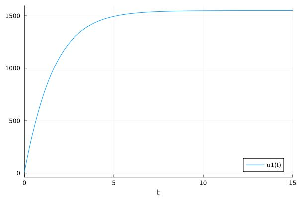

---
## Front matter
lang: ru-RU
title: Презентация по лабораторной работе №7
subtitle: Вариант №55
author:
  - Яссин Мохамад Аламин.
institute:
  - Российский университет дружбы народов, Москва, Россия
date: 23 Марта 2023

## i18n babel
babel-lang: russian
babel-otherlangs: english

## Formatting pdf
toc: false
toc-title: Содержание
slide_level: 2
aspectratio: 169
section-titles: true
theme: metropolis
header-includes:
 - \metroset{progressbar=frametitle,sectionpage=progressbar,numbering=fraction}
 - '\makeatletter'
 - '\beamer@ignorenonframefalse'
 - '\makeatother'
---

## Прагматика выполнения

- Познакомиться с простейшей моделью эффективности рекламы

- Научиться строить графики распространения рекламы с помощью OpenModelica

- Применение полученных знаний на практике в дальнейшем

  

## Goals

- Построение решения распространения информации о товаре, учитывая вклад платной рекламы
- Построение решения распространения информации о товаре, учитывая вклад «сарафанного радио» 
- Построение решения распространения информации о товаре, учитывая вклад платной рекламы и «сарафанного радио» 

- Научиться определять в какой момент времени скорость распространения рекламы будет иметь максимальное значение

- Получение новых знаний в ходе выполнения лабораторной работы

  

## Что такое простейшая модель эффективности рекламы?

Предположим, что торговыми учреждениями реализуется некоторая продукция, о которой в момент времени t из числа потенциальных покупателей N знает лишь n покупателей. Для ускорения сбыта продукции запускается реклама по радио, телевидению и других средств массовой информации. После запуска рекламной кампании информация о продукции начнет распространяться среди потенциальных покупателей путем общения друг с другом. Таким образом, после запуска рекламных объявлений скорость изменения числа знающих о продукции людей пропорциональна как числу знающих о товаре покупателей, так и числу покупателей о нем не знающих.

## Задание

Вариант 55

Постройте график распространения рекламы, математическая модель которой описывается следующим уравнением:

1.	$\frac{dn}{dt} = (0.58 + 0.00008n(t))(N-n(t))$
2.	$\frac{dn}{dt} = (0.000058 + 0.8n(t))(N-n(t))$
3.	$\frac{dn}{dt} = (0.58\cos{2t} + 0.38\cos{3t} * n(t))(N-n(t))$

При этом объем аудитории $N = 1550$, в начальный момент о товаре знает $8$ человек. Для случая $2$ определите в какой момент времени скорость распространения рекламы будет иметь максимальное значение.

## Результаты лабораторной работы

- Мы научились работать в OpenModelica

- Научились строить графики распространения рекламы

- Научились определять в какой момент времени скорость распространения рекламы будет иметь максимальное значение

  

    
  
    
  
    ### 
Спасибо за внимание!

