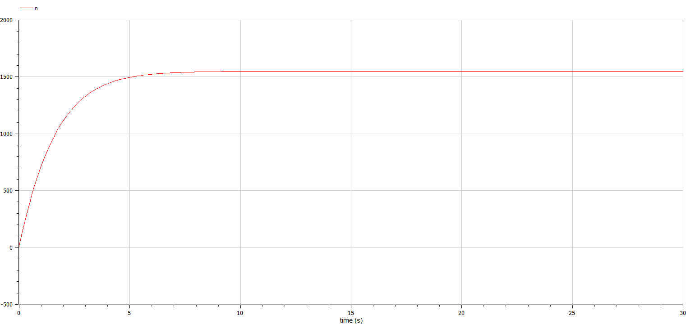
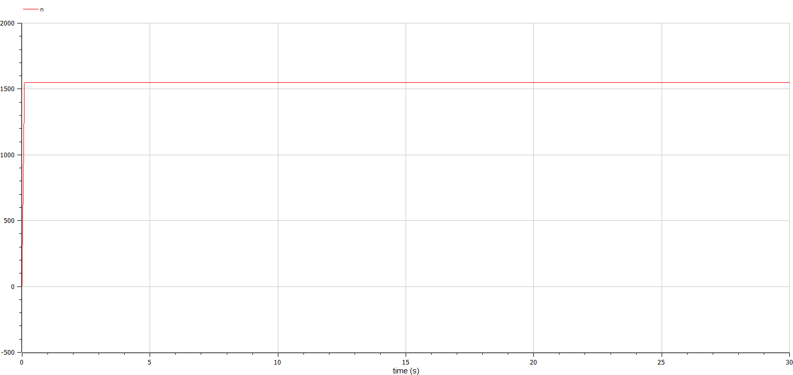
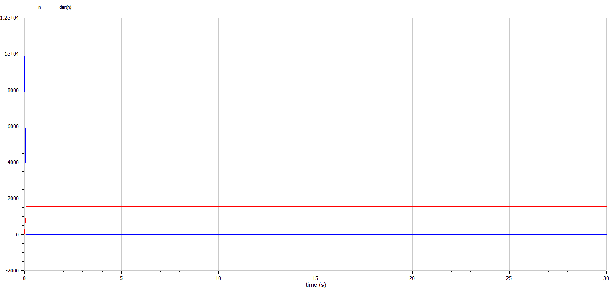

---
## Front matter
title: "Отчёт по лабораторной работе №7 "
subtitle: "Вариант № 55"
author: "Яссин Мохамад Аламин"

## Generic otions
lang: ru-RU
toc-title: "Содержание"

## Bibliography
bibliography: bib/cite.bib
csl: pandoc/csl/gost-r-7-0-5-2008-numeric.csl

## Pdf output format
toc: true # Table of contents
toc-depth: 2
lof: true # List of figures
lot: true # List of tables
fontsize: 12pt
linestretch: 1.5
papersize: a4
documentclass: scrreprt
## I18n polyglossia
polyglossia-lang:
  name: russian
  options:
	- spelling=modern
	- babelshorthands=true
polyglossia-otherlangs:
  name: english
## I18n babel
babel-lang: russian
babel-otherlangs: english
## Fonts
mainfont: PT Serif
romanfont: PT Serif
sansfont: PT Sans
monofont: PT Mono
mainfontoptions: Ligatures=TeX
romanfontoptions: Ligatures=TeX
sansfontoptions: Ligatures=TeX,Scale=MatchLowercase
monofontoptions: Scale=MatchLowercase,Scale=0.9
## Biblatex
biblatex: true
biblio-style: "gost-numeric"
biblatexoptions:
  - parentracker=true
  - backend=biber
  - hyperref=auto
  - language=auto
  - autolang=other*
  - citestyle=gost-numeric
## Pandoc-crossref LaTeX customization
figureTitle: "Рис."
tableTitle: "Таблица"
listingTitle: "Листинг"
lofTitle: "Список иллюстраций"
lotTitle: "Список таблиц"
lolTitle: "Листинги"
## Misc options
indent: true
header-includes:
  - \usepackage{indentfirst}
  - \usepackage{float} # keep figures where there are in the text
  - \floatplacement{figure}{H} # keep figures where there are in the text
---

# Цели и задачи работы

## Цель лабораторной работы

Изучить модель эффективности рекламы

## Задание к лабораторной работе

1.	Изучить модель эфеективности рекламы
2.	Построить графики распространения рекламы в заданных случайх
3.	Определить для случая 2 момент времени, в который скорость распространения рекламы будет максимальной

# Процесс выполнения лабораторной работы

## Теоретический материал 

$\frac{dn}{dt}$ - скорость изменения со временем числа потребителей, узнавших о товаре и готовых его купить,

$t$ - время, прошедшее с начала рекламной кампании,

$N$ - общее число потенциальных платежеспособных покупателей,

$n(t)$ - число  уже информированных клиентов.

## Теоретический материал 

Величина $n(t)$ пропорциональна числу покупателей, еще не знающих о нем, это описывается следующим образом
$\alpha _1(t)(N-n(t))$, где $\alpha _1>0$ -  характеризует интенсивность рекламной кампании.
Помимо этого, узнавшие о товаре потребители также распространяют полученную информацию среди потенциальных покупателей, не знающих о нем. Этот вклад в рекламу описывается величиной  $\alpha _2(t)n(t)(N-n(t))$. эта величина увеличивается с увеличением потребителей узнавших о товаре.

## Условие задачи

Постройте график распространения рекламы, математическая модель которой описывается следующим уравнением:

1.	$\frac{dn}{dt} = (0.58 + 0.00008n(t))(N-n(t))$
2.	$\frac{dn}{dt} = (0.000058 + 0.8n(t))(N-n(t))$
3.	$\frac{dn}{dt} = (0.58\cos{2t} + 0.38\cos{3t} * n(t))(N-n(t))$

При этом объем аудитории $N = 1550$, в начальный момент о товаре знает 8 человек.

Для случая 2 определите в какой момент времени скорость распространения рекламы будет иметь максимальное значение.

## График в первом случае

{ #fig:003 width=70% height=70% }
{ #fig:003 width=70% height=70% }

## График во втором случае

{ #fig:004 width=70% height=70% }
{ #fig:004 width=70% height=70% }
{ #fig:004 width=70% height=70% }
максимальная скорость распространения при $t=0$

## График в третьем случае

{ #fig:005 width=70% height=70% }
{ #fig:005 width=70% height=70% }
# Выводы по проделанной работе

## Вывод

В ходе выполнения лабораторной работы была изучена модель эффективности рекламы и построены графики.

# Список литературы{.unnumbered}

[@lab-report-number-7].

[@julia-lang].
